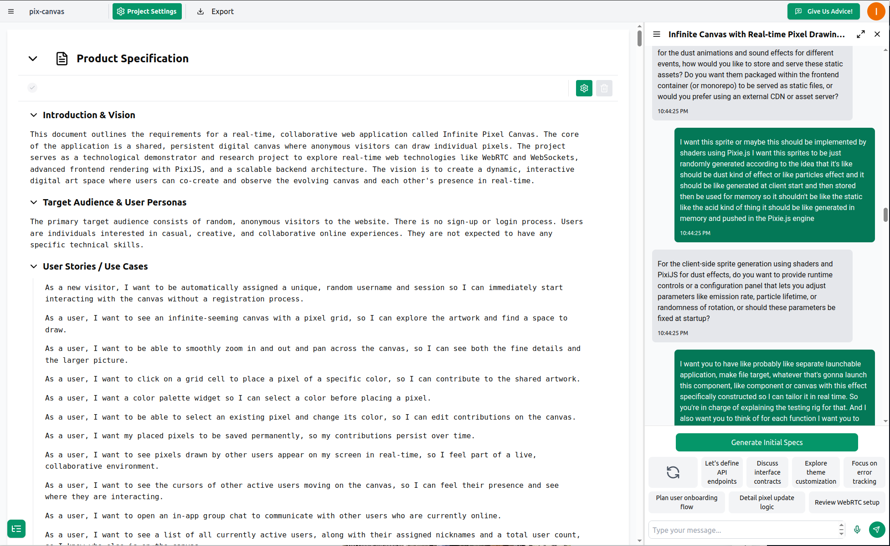
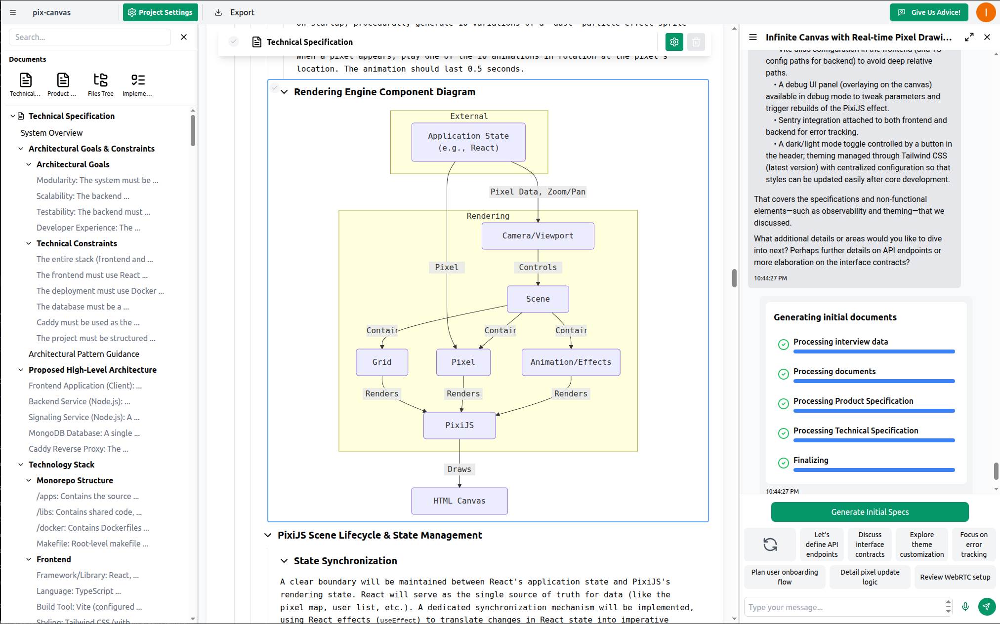
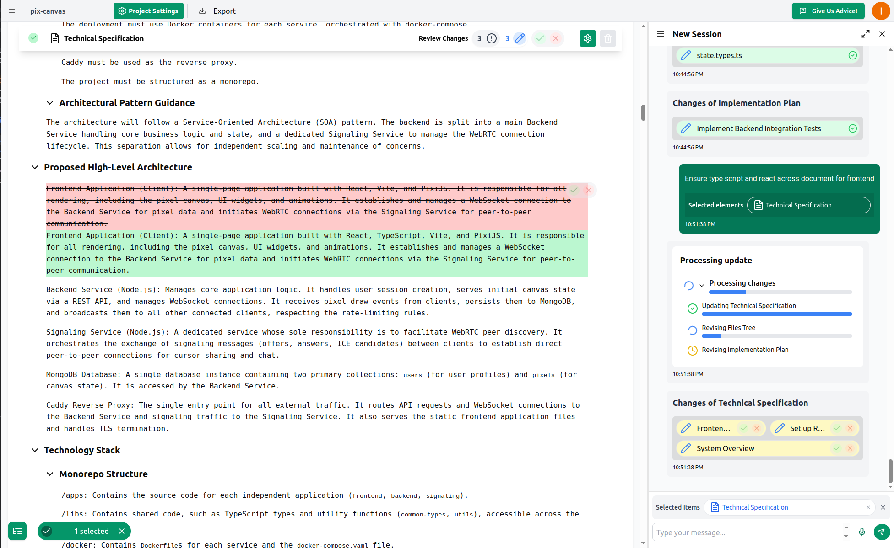
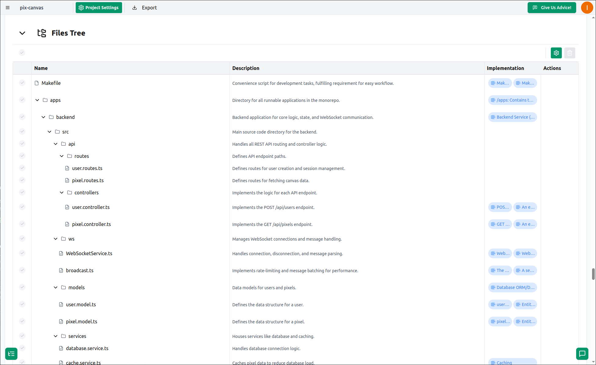
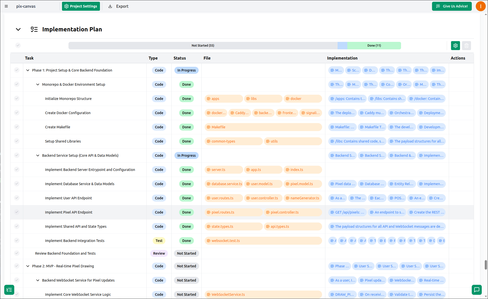
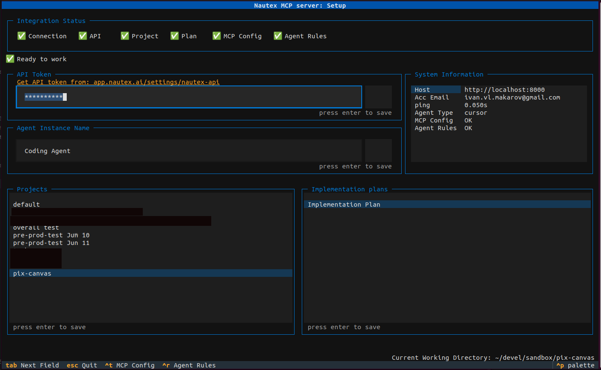
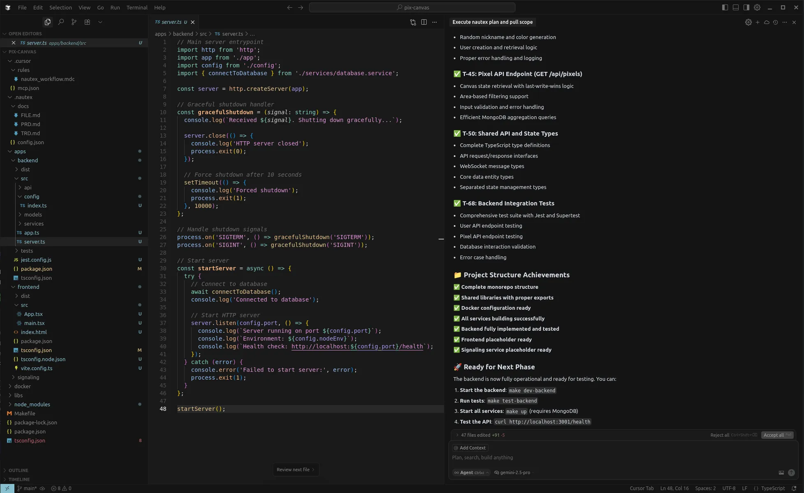
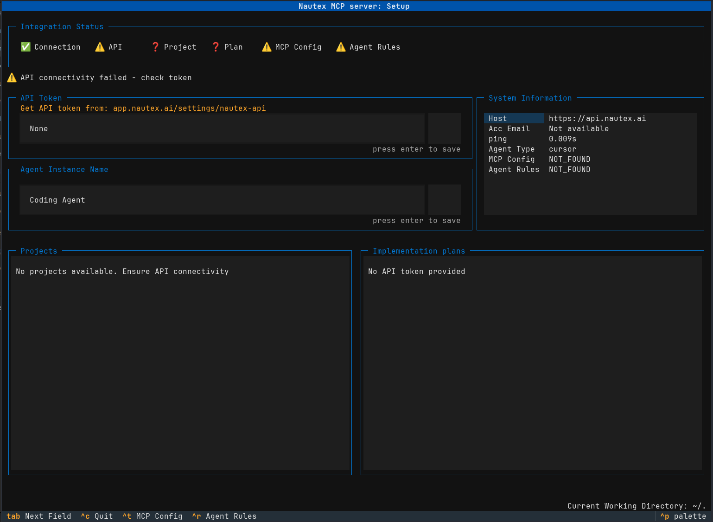

This is an MCP server that integrates PRD and TRD building tool [Nautex AI](https://nautex.ai) with the Coding Agents.

Supported agents:
- Claude Code
- Cursor
- Codex
- OpenCode
- Gemini CLI

# Motivation

Since LLM Coding Agents do not attend team meetings, there is the challenge of conveying complete and detailed product and technical requirements to them.

Nautex AI tool-chain manages step by step guiding of Coding Agents so they implement specification using small, relevant and testable steps.

Core principles are:
1) start from foundational parts, de-risk them, then build up;
2) do not overwhelm Coding Agents by large problem at once;
3) plan project files map and link them to requirements and to tasks: Coding Agents don't get lost, you know how to navigate brand new code base;
4) manage developer attention for verification and validation in right moment for review.

# How It Works

Nautex AI acts as an Architect, Technical Product Manager, and Project Manager for coding agents,
speeding up AI-assisted development by communicating requirements effectively.
This MCP server pulls guidance instructions from Nautex AI; tasks contain to-do items,
references to the affected files, and requirements that are automatically synced for the Coding Agent's availability.

By [Ivan Makarov](https://x.com/ivan_mkrv)


<details>
<summary>Usage Flow Presentation (unfold me)</summary>

## Requirements Specifications

The chatbot conducts a briefing session with you, gathering questions and ideas until complete. It then generates comprehensive product and technical specifications.

(Example: A project I initiated to explore WebRTC.)

Product requirements:


Technical requirements:


## Specification Refinement

You fill in details, clarify the specification, and resolve any TODOs flagged by the chatbot during the interview.



## Codebase Map and Project Files

You'll occasionally need to review the code, so it's best to know in advance where to look and how everything is organized. This prevents the AI from making decisions—allowing it to focus on writing higher-quality code with greater attention to the task.

The image displays a file map generated by Nautex AI, with files linked to specific requirements and sections.



## Agent Tasks

With the code location clarified, tasks are planned: Coding, Testing, and Review.

Reviews are scheduled early to demonstrate progress and verify alignment with goals.

The plan is structured in small, self-contained layers, building your project incrementally like floors in a skyscraper.



## Integration

Configure the MCP server for your coding agent: connect to the Nautex cloud platform, select the project, and choose the implementation plan. The setup command writes all configuration to your project root.



## Coding with Coding Agents

In agent mode, instruct: "pull nautex rules, and proceed with the next scope."

At this stage, your specifications are synchronized in the .nautex directory and accessible to the Coding Agent. The MCP server continuously monitors their relevance.

That's it. You then review and accept substantial code segments that fully align with your expectations and requirements.



</details>

# Setup

## Quick Setup (one command)

The fastest way to set up is via the web app onboarding flow, which generates a single command you copy and run in your project root:

```bash
uvx nautex setup --token <TOKEN> --project <PROJECT_ID> --plan <PLAN_ID> --agent <AGENT>
```

**Parameters:**
| Flag | Description |
|------|-------------|
| `--token`, `-t` | API token (create at [nautex.ai](https://app.nautex.ai/settings/nautex-api)) |
| `--project`, `-p` | Project ID |
| `--plan`, `-l` | Implementation plan ID |
| `--agent`, `-a` | Agent type: `claude`, `cursor`, `codex`, `opencode`, `gemini` |
| `--yes`, `-y` | Skip confirmation prompts |

This validates your token, project, and plan, then writes all configuration to your project root:
- `.nautex/config.json` — project config
- `.nautex/.env` — API token (git-ignored)
- MCP config — agent-specific (see below)
- Agent rules — merged into existing rule files without overriding your content

## Interactive Setup (Terminal UI)

Alternatively, run the interactive terminal UI:

```bash
uvx nautex setup
```



Follow the on-screen prompts to select your project, plan, and agent.

<details>
<summary>How to Install UV</summary>

On macOS and Linux:
```bash
curl -LsSf https://astral.sh/uv/install.sh | sh
```

On Windows:
```bash
powershell -ExecutionPolicy ByPass -c "irm https://astral.sh/uv/install.ps1 | iex"
```

Check the latest instructions from the [UV repo](https://github.com/astral-sh/uv) for details and updates.
</details>

## What Gets Written Per Agent

All configuration is scoped per-project in your project root.

<details>
<summary>Claude Code</summary>

- MCP: registered via `claude mcp add nautex -s local -- uvx nautex mcp`
- Rules: managed section added to `CLAUDE.md`
- Verify: run `claude mcp list` and check for `nautex: uvx nautex mcp`
</details>

<details>
<summary>Cursor</summary>

- MCP config: `.cursor/mcp.json`
- Rules: `.cursor/rules/nautex_workflow.mdc`

**Note:** After setup, Cursor may ask via popup whether to enable the new MCP — answer yes. In any case, go to `File -> Preferences -> Cursor Settings -> Tools & Integrations` and make sure the Nautex MCP toggle is enabled (green).
</details>

<details>
<summary>Codex</summary>

- MCP config: `.codex/config.toml` (project-local, backup created as `config.toml.bak` before first write)
- Rules: managed section added to `AGENTS.md`
- Verify: use the `/mcp` command inside Codex to confirm `nautex` is listed
</details>

<details>
<summary>OpenCode</summary>

- MCP config: `opencode.json` (project root, preserves unrelated fields, backup as `opencode.json.bak` if unparsable)
- Rules: managed section added to `AGENTS.md`
- Verify: invoke the Nautex MCP tool from OpenCode and run `status`
</details>

<details>
<summary>Gemini CLI</summary>

- MCP config: `.gemini/settings.json`
- Rules: managed section added to `GEMINI.md`
</details>

## Start Coding

Once setup is complete, launch your coding agent and tell it:

> Check nautex status

After confirming the connection works:

> Pull nautex rules and proceed to the next scope

Proceed with the plan by reviewing progress and supporting the Agent with validation feedback and inputs.

# Prerequisites

Before running setup, prepare your project in the [Nautex web app](https://app.nautex.ai):

1. Sign up and create an API token
2. Create PRD and TRD documents (chat with the bot to capture requirements)
3. Create a files map of the project
4. Create an implementation plan

The web app onboarding flow will generate the setup command with all IDs pre-filled.

# Projects built with nautex

- [Collaborative Pixel Canvas](https://pixall.art) - [repo](https://github.com/hmldns/pix-canvas)

# Best practice from the community

<a href="https://discord.gg/nautex" target="_blank"></a>
